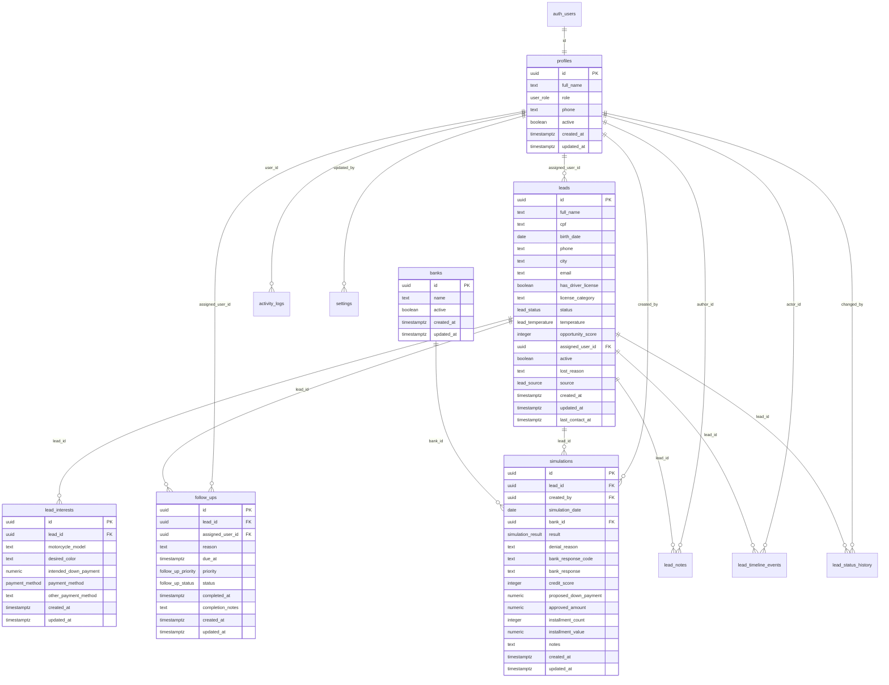

# Aliança CRM - Revisão da Etapa de Persistência, Autenticação, Permissões e Auditoria

Este documento é a entrega de revisão antes de aplicar qualquer alteração em um Supabase real.

Migração proposta:

`supabase/migrations/20260715120000_persistence_auth_permissions_audit.sql`

## 1. Diagrama das tabelas



## 2. Migração SQL

Arquivo criado:

`supabase/migrations/20260715120000_persistence_auth_permissions_audit.sql`

Inclui:

- Tipos enum para papéis, status de lead, temperatura, fonte do lead, forma de pagamento, resultado de simulação, tipos de timeline e status/prioridade de retorno.
- Tabelas solicitadas: `profiles`, `leads`, `lead_interests`, `simulations`, `follow_ups`, `lead_notes`, `lead_timeline_events`, `lead_status_history`, `activity_logs`, `settings`.
- Tabela adicional `banks` para normalizar instituições financeiras e evitar variações como `PAN`, `Pan` e `Banco PAN`.
- `simulations` usa `bank_id` e mantém `bank_response_code`/`bank_response` para registrar a resposta detalhada do banco.
- Normalização de CPF e telefone via trigger `normalize_lead_contact`.
- Constraints para CPF com 11 dígitos e telefone com 10 a 13 dígitos.
- Detecção de possíveis duplicidades por CPF ou telefone com a função `find_potential_duplicate_leads`, sem apagar cadastros automaticamente.
- Índices para CPF, telefone, status, responsável, prazo de retorno, modelo, cidade e última simulação por lead.
- Triggers `updated_at`.
- Triggers de auditoria e timeline automática para eventos relevantes. Updates simples de dados cadastrais vão para `activity_logs`, sem poluir a timeline.
- Funções auxiliares de permissão: `is_admin`, `is_active_user`, `can_access_lead`.
- Sanitização de logs para remover `cpf`, `phone`, `birth_date`, `token`, `access_token` e `refresh_token` de metadados.

## 3. Políticas RLS

RLS foi ativado em todas as tabelas públicas criadas.

Resumo:

- `profiles`
  - Usuário autenticado vê o próprio perfil.
  - Admin vê todos.
  - Apenas admin cria ou atualiza profiles.

- `leads`
  - Admin vê todos.
  - Vendedor vê leads ativos atribuídos a ele.
  - Vendedor pode inserir lead para si ou sem responsável inicial.
  - Vendedor pode atualizar leads atribuídos a ele, mas não pode marcar como perdido.
  - Admin pode alterar responsável, corrigir dados e marcar perdido.

- `lead_interests`, `simulations`, `lead_notes`, `follow_ups`
  - Acesso condicionado a `can_access_lead(lead_id)`.
  - Simulação só pode ser criada por usuário autenticado ativo e `created_by = auth.uid()`.
  - Correção de simulação fica restrita a admin.

- `banks`
  - Usuário autenticado ativo consulta bancos ativos.
  - Admin consulta e gerencia todos os bancos.

- `lead_timeline_events`
  - Usuários autorizados no lead podem consultar.
  - Eventos podem ser inseridos pelas funções/triggers.
  - Atualização direta restrita a admin, mantendo timeline imutável para vendedores.

- `lead_status_history`
  - Consulta por usuários autorizados no lead.
  - Inserção controlada por trigger/função no fluxo.

- `activity_logs`
  - Apenas admin consulta logs.
  - Inserção permitida para usuário autenticado ativo, sanitizada pela função.

- `settings`
  - Apenas admin lê ou altera.

Nenhuma policy concede acesso a `anon`.

## 4. Variáveis de ambiente

Frontend e Server Actions com cliente anon:

```env
NEXT_PUBLIC_SUPABASE_URL=
NEXT_PUBLIC_SUPABASE_ANON_KEY=
```

Somente backend seguro, quando houver necessidade administrativa via server-side:

```env
SUPABASE_SERVICE_ROLE_KEY=
```

Regras:

- `SUPABASE_SERVICE_ROLE_KEY` nunca deve ser usada em componente client.
- `SUPABASE_SERVICE_ROLE_KEY` não deve ter prefixo `NEXT_PUBLIC_`.
- Não salvar tokens em `localStorage`.
- Usar cookies/sessão do Supabase Auth para persistência.

## 5. Plano de migração dos mocks

1. Aplicar a migração em um projeto Supabase de homologação.
2. Criar o primeiro usuário administrador pelo painel do Supabase Auth.
3. Inserir manualmente ou via script um `profiles` com `role = 'admin'` para esse usuário.
4. Implementar cliente Supabase para navegador e servidor com cookies.
5. Criar rota/tela de login e recuperação de senha.
6. Proteger o app: usuário sem sessão deve ir para login.
7. Substituir `leadsSeed` por queries reais:
   - Dashboard: `leads`, `follow_ups`, `simulations`, `banks`.
   - Kanban: `leads` com `lead_interests`.
   - Pesquisa/filtros: query paginada em `leads` e joins necessários.
   - Página do lead: `leads`, `lead_interests`, `simulations`, `banks`, `follow_ups`, `lead_notes`, `lead_timeline_events`.
8. Migrar `addLead`, `addSimulationToSelected`, drag-and-drop e conclusão de retorno para Server Actions.
9. Após cada mutation, revalidar dados necessários e retornar feedback de sucesso/erro.
10. Remover uso de mocks do fluxo principal.
11. Manter mocks apenas em testes ou em ambiente explicitamente separado de demonstração.
12. Cadastrar cinco leads fictícios em homologação para validar o fluxo completo.
13. Só inserir dados reais após autorização explícita.

## 6. Riscos e pontos de atenção

- A criação de usuários não deve ser pública; precisa de fluxo administrativo server-side com service role protegida.
- Policies precisam ser testadas com usuários reais de papéis diferentes, não apenas com admin.
- A duplicidade é tratada como revisão operacional: o frontend deve chamar `find_potential_duplicate_leads` antes de salvar, exibir alerta e permitir revisão administrativa. A migração mantém índices não únicos para consulta rápida e não apaga registros automaticamente.
- Simulações não têm delete policy. Se for criado delete acidental no futuro, deve ser bloqueado por RLS/trigger.
- Timeline foi reduzida para eventos relevantes: criação, status, responsável, simulação, retorno, observação, WhatsApp, perdido e venda. Edições cadastrais simples devem ficar em `activity_logs`.
- Logs não devem receber metadados sensíveis. A função sanitiza chaves conhecidas, mas o app também deve evitar enviar dados sensíveis.
- Drag-and-drop persistente deve validar transições permitidas para vendedor no backend, não só no frontend.
- O cálculo do score deve ter uma única fonte de verdade. Recomenda-se função server-side ou coluna recalculada em mutations relevantes.
- O campo `assigned_user_id` continua como responsável atual para simplificar a homologação. A evolução recomendada é criar `lead_assignments` com `lead_id`, `user_id`, `assigned_by`, `started_at`, `ended_at` e `reason`, mantendo histórico completo quando a equipe crescer ou houver troca frequente de vendedores.
- Recuperação de senha depende de URLs de redirect configuradas no Supabase Auth.
- Ambientes de produção e homologação devem usar bancos e chaves separados.

## 7. Checklist de testes

- [ ] Login válido.
- [ ] Login inválido.
- [ ] Usuário desativado não acessa o CRM.
- [ ] Usuário sem sessão é redirecionado para login.
- [ ] Logout encerra sessão.
- [ ] Recuperação de senha dispara fluxo correto.
- [ ] Vendedor acessa apenas leads atribuídos a ele.
- [ ] Vendedor não acessa lead de outro vendedor por URL direta.
- [ ] Admin acessa todos os leads.
- [ ] Admin cria/ativa/desativa usuário.
- [ ] Vendedor não gerencia usuários.
- [ ] CPF é normalizado antes de salvar.
- [ ] Telefone é normalizado antes de salvar.
- [ ] CPF duplicado gera alerta e bloqueio/revisão.
- [ ] Telefone duplicado gera alerta e bloqueio/revisão.
- [ ] Criação de lead persiste no Supabase.
- [ ] Edição cadastral simples de lead persiste e cria `activity_logs`, sem criar evento genérico na timeline.
- [ ] Edição relevante de lead, como status ou responsável, persiste e cria timeline.
- [ ] CPF aparece mascarado nas listas.
- [ ] CPF completo aparece apenas na página interna para usuário autorizado.
- [ ] Nova simulação persiste.
- [ ] Nova simulação exige `bank_id` válido.
- [ ] Resposta detalhada do banco é salva quando informada.
- [ ] Simulação negada exige motivo.
- [ ] Negativa sugere data de retorno.
- [ ] Data sugerida pode ser editada.
- [ ] Negativa cria `follow_ups`.
- [ ] Negativa cria evento de timeline.
- [ ] Aprovação atualiza dados relevantes.
- [ ] Alteração de status cria `lead_status_history`.
- [ ] Vendedor só altera status dentro do fluxo permitido.
- [ ] Admin consegue marcar lead como perdido.
- [ ] Vendedor não consegue marcar lead como perdido.
- [ ] Conclusão de retorno persiste e cria timeline.
- [ ] Retorno adiado persiste e cria timeline.
- [ ] Observação adicionada cria timeline.
- [ ] WhatsApp acionado registra timeline sem dados sensíveis.
- [ ] Drag-and-drop persiste status no banco.
- [ ] Dashboard atualiza após mutation.
- [ ] Pipeline atualiza após mutation.
- [ ] Timeline atualiza após mutation.
- [ ] Edição cadastral simples não cria evento genérico “Lead editado” na timeline.
- [ ] Fila de retornos atualiza após mutation.
- [ ] Pesquisa consulta Supabase.
- [ ] Filtros consultam Supabase.
- [ ] Score é calculado corretamente.
- [ ] RLS bloqueia acesso anônimo.
- [ ] RLS bloqueia vendedor em registros alheios.
- [ ] RLS permite admin em todos os registros.
- [ ] Service role não aparece no bundle frontend.
- [ ] Dados sensíveis não aparecem em `activity_logs.metadata_json`.
- [ ] Build de produção passa.

## 8. Próximos passos após aprovação

1. Aplicar migrações no Supabase de homologação.
2. Criar usuário administrador.
3. Implementar fluxo Auth no app.
4. Trocar queries mockadas por Supabase.
5. Executar checklist.
6. Cadastrar cinco leads fictícios.
7. Validar fluxo completo com admin e vendedor.
8. Gerar walkthrough.
9. Aguardar autorização antes de inserir dados reais de clientes.
